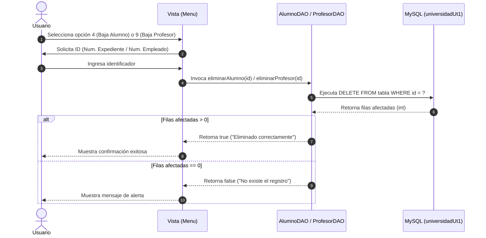

<div align="center">

# 🐺 SISTEMA UNIVERSIDAD UT | MÓDULO DE BAJAS (DELETE) 🐺
### *Eliminación Segura de Alumnos y Profesores mediante JDBC & MySQL*
**`Universidad UT` • `Actitud Lobo`**

[](https://www.oracle.com/java/)
[](https://www.mysql.com/)
[](https://maven.apache.org/)
[-dc2626?style=for-the-badge&logo=trash&logoColor=white)](https://github.com/)
[](https://github.com/)

---

```text
 ____   ___  ____  ____      _    ____    ____    _        _    ____  
| __ ) / _ \|  _ \|  _ \    / \  |  _ \  | __ )  / \      | |  / ___| 
|  _ \| | | | |_) | |_) |  / _ \ | |_) | |  _ \ / _ \  _  | |  \___ \ 
| |_) | |_| |  _ <|  _ <  / ___ \|  _ <  | |_) / ___ \| |_| |   ___) |
|____/ \___/|_| \_\_| \_\/_/   \_\_| \_\ |____/_/   \_\\___/   |____/ 
                  🐾 ACTITUD LOBO • INGENIERÍA 🐾
```

</div>

---

## 📋 Ficha Técnica & Datos Académicos

| Campo | Información |
| :--- | :--- |
| 👨‍🎓 **Estudiante / Desarrollador** | **Kurt Cobain Vázquez Sánchez** |
| 👨‍🏫 **Profesor / Asesor** | **René Santos Osorio** |
| 🏛️ **Institución** | Universidad Tecnológica (UT) |
| 🐺 **Identidad Universitaria** | **Actitud Lobo** |
| 📚 **Materia / Área** | Programación Orientada a Objetos & Gestión de Bases de Datos |
| 🧩 **Patrón Arquitectónico** | DAO (*Data Access Object*) + Manejo de Transacciones SQL |
| 🔌 **Tecnologías** | Java SE 21+/26, JDBC (*MySQL Connector/J 9.7.0*), Apache Maven, MySQL Server |

---

## 🌟 Descripción del Proyecto

Este repositorio contiene la implementación del **Módulo de Bajas y Eliminación de Registros (DELETE)** del Sistema Universitario de la **Universidad UT**. La aplicación permite gestionar el ciclo de vida de los registros académicos, brindando soporte transaccional para la desincorporación controlada de **Alumnos** (mediante su Número de Expediente) y **Profesores** (mediante su Número de Empleado).

El sistema garantiza la integridad referencial y valida la existencia previa del registro antes de confirmar la baja física en la base de datos MySQL, retornando retroalimentación inmediata al usuario.

```text
                       ┌────────────────────────┐
                       │   Entrada de Usuario   │
                       │ (NumExpediente/Empleado)│
                       └───────────┬────────────┘
                                   │
                                   ▼
                       ┌────────────────────────┐
                       │    Capa DAO (JDBC)     │
                       │ DELETE FROM ... WHERE  │
                       └───────────┬────────────┘
                                   │
                    ┌──────────────┴──────────────┐
                    ▼                             ▼
        ┌───────────────────────┐     ┌───────────────────────┐
        │  Filas Afectadas > 0  │     │  Filas Afectadas = 0  │
        │ "Eliminado con éxito" │     │ "No existe registro"  │
        └───────────────────────┘     └───────────────────────┘
```

---

## 🚀 Características Principales

- 🗑️ **Baja de Alumnos:** Método `eliminarAlumno(int numExpediente)` en `AlumnoDAO` que ejecuta `DELETE FROM alumnos WHERE numExpediente = ?`.
- 🗑️ **Baja de Profesores:** Método `eliminarProfesor(int numEmpleado)` en `ProfesorDAO` que ejecuta `DELETE FROM profesores WHERE numEmpleado = ?`.
- 🛡️ **Validación de Filas Afectadas:** Detección de operaciones no exitosas mediante `executeUpdate() > 0`, notificando si el registro solicitado no existe.
- ⚡ **Prevención de Inyecciones SQL:** Uso estricto de `PreparedStatement` para garantizar la seguridad de las transacciones.
- 📋 **Menú Unificado de 10 Opciones:** Integración de operaciones de inscripción, consulta, modificación y baja en una consola interactiva fluida.

---

## 🏗️ Flujo de Eliminación de Registros (Mermaid)



---

## 📊 Matriz de Operaciones del Menú

| Opción | Operación | Método Invocado | Sentencia SQL / Acción |
| :---: | :--- | :--- | :--- |
| `1` | Inscribir Alumno | `inscribir()` | `INSERT INTO alumnos ...` |
| `2` | Mostrar Alumnos | `mostrarAlumnos()` | `SELECT * FROM alumnos` |
| `3` | Actualizar Alumno | `actualizarALumno()` | `UPDATE alumnos SET ... WHERE numExpediente = ?` |
| `4` | **Dar de baja Alumno** | `bajaAlumno()` | `DELETE FROM alumnos WHERE numExpediente = ?` |
| `5` | Buscar Alumno | `buscarAlumno()` | En desarrollo |
| `6` | Agregar Profesor | `agregarProfesor()` | `INSERT INTO profesores ...` |
| `7` | Mostrar Profesores | `mostrarProfesores()` | `SELECT * FROM profesores` |
| `8` | Modificar Profesor | `actualizarProfesor()` | `UPDATE profesores SET ... WHERE numEmpleado = ?` |
| `9` | **Dar de baja Profesor** | `bajaProfesor()` | `DELETE FROM profesores WHERE numEmpleado = ?` |
| `10` | Salir del Sistema | Salida del bucle | Finalización del programa |

---

## 🗃️ Script de Base de Datos (MySQL)

```sql
-- Base de datos para el módulo de bajas
CREATE DATABASE IF NOT EXISTS universidadUt1 CHARACTER SET utf8mb4 COLLATE utf8mb4_unicode_ci;
USE universidadUt1;

-- Tabla alumnos
CREATE TABLE IF NOT EXISTS alumnos (
    numExpediente INT PRIMARY KEY,
    nombre VARCHAR(100) NOT NULL,
    curp VARCHAR(18) NOT NULL UNIQUE,
    grupo VARCHAR(20) NOT NULL,
    promedio DOUBLE NOT NULL
);

-- Tabla profesores
CREATE TABLE IF NOT EXISTS profesores (
    numEmpleado INT PRIMARY KEY,
    nombre VARCHAR(100) NOT NULL,
    curp VARCHAR(18) NOT NULL UNIQUE,
    nombreEmpleado VARCHAR(100) NOT NULL,
    puesto VARCHAR(50) NOT NULL,
    sueldo DOUBLE NOT NULL
);
```

---

## 📂 Estructura del Proyecto

```text
UniversidadUT/
├── pom.xml                                   # Configuración de dependencias Maven
└── src/
    └── main/
        └── java/
            └── org/
                └── example/
                    ├── Main.java             # Clase de inicio
                    ├── config/
                    │   └── Conexion.java     # Conexión JDBC con MySQL
                    ├── dao/
                    │   ├── AlumnoDAO.java    # Métodos con lógica DELETE para Alumnos
                    │   └── ProfesorDAO.java  # Métodos con lógica DELETE para Profesores
                    ├── modelo/
                    │   ├── PersonaUt.java    # Clase base abstracta
                    │   ├── Alumno.java       # Entidad Alumno
                    │   └── Profesor.java     # Entidad Profesor
                    └── vista/
                        └── Menu.java         # Menú interactivo de consola
```

---

## ⚡ Guía de Instalación y Ejecución

```bash
# 1. Clonar el repositorio
git clone https://github.com/tu-usuario/borrar-alumnos-y-profesores.git
cd borrar-alumnos-y-profesores/UniversidadUT

# 2. Compilar con Maven
mvn clean compile

# 3. Ejecutar la aplicación
mvn exec:java -Dexec.mainClass="org.example.Main"
```

---

## 💻 Demostración de Baja en Consola

```text
========== MENU ==========
1.- Inscribir Alumno
2.- Mostrar Alumnos
3.- Actualizar Alumno
4.- Dar de baja Alumno
5.- Buscar Alumno
6.- Agregar Profesor
7.- Mostrar Profesores
8.- Modificar Profesor
9.- Dar de baja Profesor
10.- Salir
==========================
Elige tu opción: 4
Numero de expediente del alumno a eliminar: 1001
Alumno eliminado correctamente

Elige tu opción: 9
Numero de empleado del profesor a eliminar: 2001
Registros eliminados: 1
Profesor eliminado correctamente
```

---

<div align="center">

### 🐺 ¡Orgullo y Excelencia Académica con Actitud Lobo! 🐺
Desarrollado con dedicación y buenas prácticas de ingeniería de software.

**Universidad Tecnológica • 2026**

</div>
